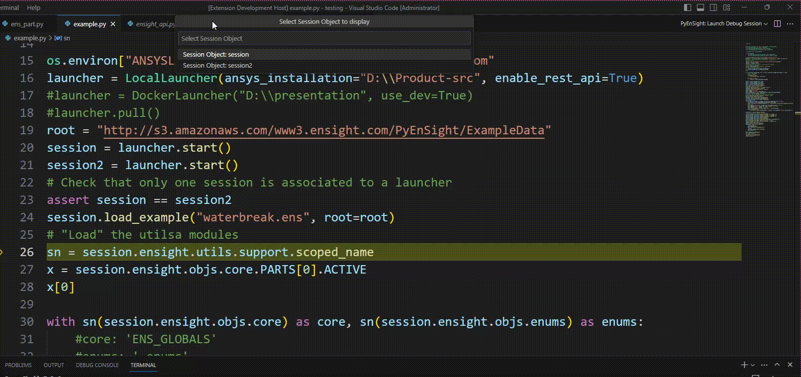
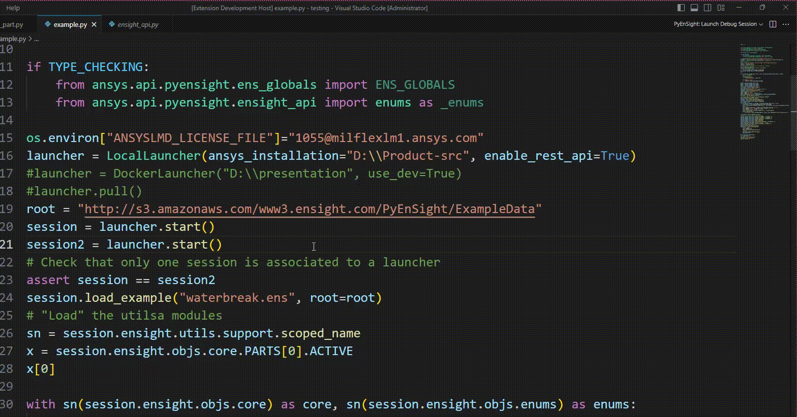

# PyEnSight Visual Studio Code Extension

## Overview

The PyEnsight Visual Studio Code Extension is a [Visual Studio
Code](https://code.visualstudio.com/)
[extension](https://marketplace.visualstudio.com/VSCode) that supports
[PyEnSight](https://ensight.docs.pyansys.com/version/stable/), a PyAnsys
library. This extension provides renderables embedding, augmented hover
links, and snippets that empower the writing and debugging of PyEnSight
scripts.

## Quick start

-   Install a PyEnSight-supported version on your system.
-   Install the PyEnSight Visual Studio Code Extension as described in
    [Extension
    Marketplace](https://code.visualstudio.com/docs/editor/extension-marketplace)
    in the Visual Studio Code documentation.
-   If a default Python interpreter is not set in Visual Studio Code,
    use **Python: Set Interpreter** on the command palette to set one.

## Features

-   Hover over a string in Visusal Studio Code\'s text editor to see the
    link to the relevant PyEnsight documentation.

-   Launch a *PyEnSight debug session* to start a new Python debug
    session in which to select the session and renderable.

-   Launch a *PyEnsight WebView* during a Python debug session to select
    a specific session and the renderable to display.

-   Use supplied snippets to simplify the scripting experience. Just
    start typing any of the snippets and press tab on the highlighted
    one to get useful code for your Python script.. Here is a list of
    available snippets:

    > -   *LocalLauncher / locallauncher*
    > -   *DockerLauncher / dockerlauncher*
    > -   *EnSContext / enscontext*
    > -   *load_data*
    > -   *export / image*
    > -   *export / animation*
    > -   *query / plot*

## PyEnSight debug session and WebView

You can launch a PyEnSight debug session using **PyEnSight: Launch Debug
Session** on the command palette. You are then asked to select a
renderable from the following options:

-   **image**: A picture of the current EnSight status.
-   **deep_pixel**: A deep-pixel picture of the current EnSight status.
-   **animation**: A transient animation of the current dataset and
    status in EnSight.
-   **webgl**: An embedded AVZ viewer showing the current status of
    EnSight exported in AVZ format.
-   **remote**: A VNC stream of the current EnSight rendering window
    with a simple web UI.
-   **remote_scene**: A VNC stream to an
    [EnVision](https://www.ansys.com/products/fluids/ansys-ensight/envision-viewer)
    instance showing the current status of EnSight exported as a
    scenario.
    [EnVision](https://www.ansys.com/products/fluids/ansys-ensight/envision-viewer)
    is a lightweight
    [EnSight](https://www.ansys.com/products/fluids/ansys-ensight)
    viewer that supports high-speed flipbooks, rendering, and additional
    features for creating high-quality views of your models exported in
    *scenario* format via
    [EnSight](https://www.ansys.com/products/fluids/ansys-ensight).
    EnVision can reduce the size of the analysis when dealing with large
    transient simulations and improve the interactivity.
-   **webensight** (beta feature): A VNC stream of the current EnSight
    rendering window with a full web UI.

{width="600px"}

Selecting a renderable option launches a standard Python debug session.
At the first breakpoint where at least a PyEnSight object is available
on the stack frame, you are asked which session to show. A panel
displaying the selected renderable and session appears on the side. This
panel also displays the current status of the postprocessing session. As
you walk through the script, you can see the updated renderable so that
you can follow what is happening in EnSight while debugging the script.

{width="600px"}

Alternatively, you can launch the panel after a Python debug session has
been started using **PyEnSight: Launch WebView** on the command palette.
You should always use this command when a breakpoint is hit and at least
a `Session` object is available.

Both PyEnsight launch commands are also available as options when you
right-click in Visual Studio Code\'s text editor or select from the
**Run** submenu on the top right of its UI.

## Other commands

-   **PyEnSight: Open the PyEnSight documentation**: Launches the
    default browser to display the PyEnSight documentation.
-   **PyEnSight: Open the EnSight Python API documentation**: Launches
    the default browser to display the EnSight Python API documentation.
-   **PyEnSight: Help**: Opens an information window listing the main
    PyEnSight extension features and version. This command is useful for
    checking that you have the correct installation of the extension.
-   **PyEnSight: Install PyEnSight**: Detects the current selected
    Python interpreter and installs PyEnSight. Before using this
    command, you want to ensure that the correct interpreter is set.

## Hovering

Inside of Visual Studio Code\'s text editor, you can hover over any
object to access the link to the PyEnSight documentation that describes
this object.

{width="600px"}

## License

[MIT](https://github.com/ansys-internal/ansys-pyensight-vscode/blob/main/LICENSE)
