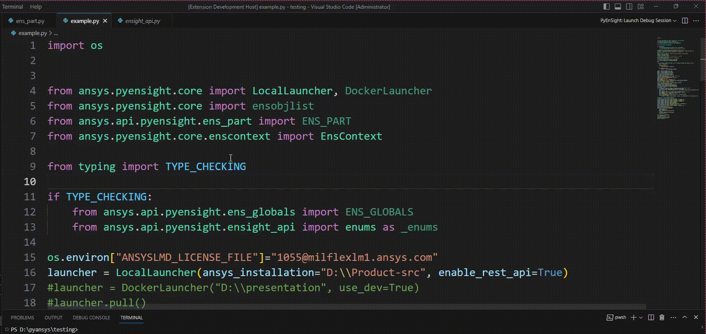
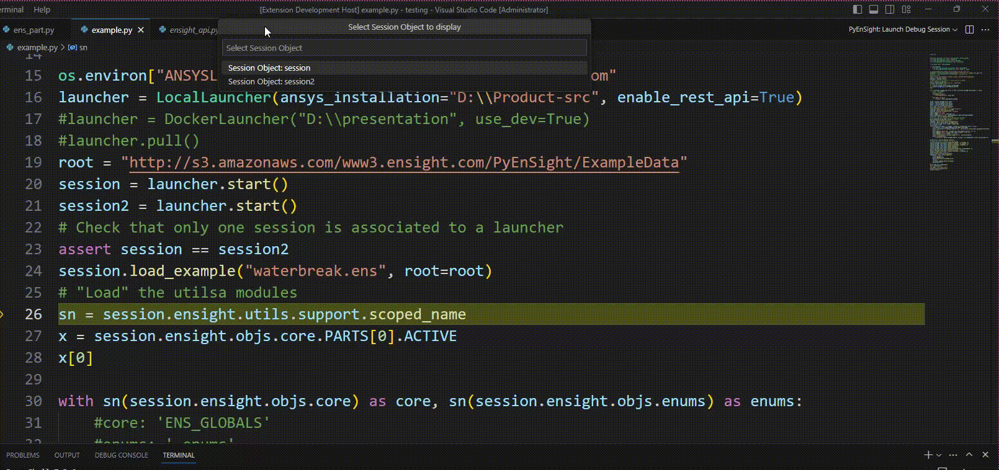
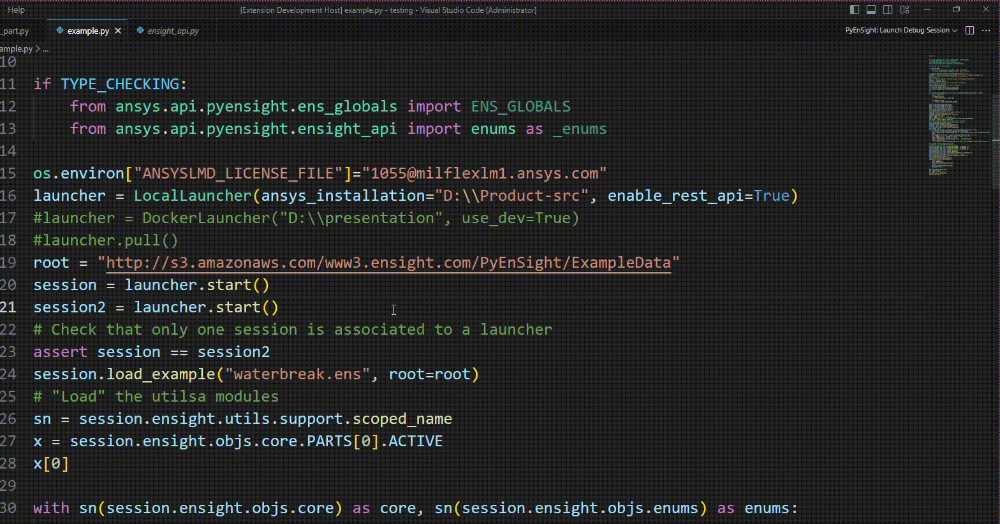

PyEnSight Visual Studio Code Extension
======================================
|pyansys| |MIT| |ci|

.. |pyansys| image:: https://img.shields.io/badge/Py-Ansys-ffc107.svg?logo=data:image/png;base64,iVBORw0KGgoAAAANSUhEUgAAABAAAAAQCAIAAACQkWg2AAABDklEQVQ4jWNgoDfg5mD8vE7q/3bpVyskbW0sMRUwofHD7Dh5OBkZGBgW7/3W2tZpa2tLQEOyOzeEsfumlK2tbVpaGj4N6jIs1lpsDAwMJ278sveMY2BgCA0NFRISwqkhyQ1q/Nyd3zg4OBgYGNjZ2ePi4rB5loGBhZnhxTLJ/9ulv26Q4uVk1NXV/f///////69du4Zdg78lx//t0v+3S88rFISInD59GqIH2esIJ8G9O2/XVwhjzpw5EAam1xkkBJn/bJX+v1365hxxuCAfH9+3b9/+////48cPuNehNsS7cDEzMTAwMMzb+Q2u4dOnT2vWrMHu9ZtzxP9vl/69RVpCkBlZ3N7enoDXBwEAAA+YYitOilMVAAAAAElFTkSuQmCC
   :target: https://docs.pyansys.com/

.. |MIT| image:: https://img.shields.io/badge/License-MIT-yellow.svg
   :target: https://opensource.org/licenses/MIT

.. |ci| image:: https://github.com/ansys-internal/ansys-pyensight-vscode/actions/workflows/ci_cd.yml/badge.svg?branch=main
   :target: https://github.com/ansys-internal/ansys-pyensight-vscode/actions?query=branch%3Amain

.. |title| image:: https://s3.amazonaws.com/www3.ensight.com/build/media/pyensight_title.png

.. _EnSight: https://www.ansys.com/products/fluids/ansys-ensight

.. _PyEnSight: https://ensight.docs.pyansys.com/version/stable/

.. _MIT: https://github.com/ansys-internal/ansys-pyensight-vscode/blob/main/LICENSE

.. _VSCode: https://code.visualstudio.com/

.. _extension: https://marketplace.visualstudio.com/VSCode

.. _Python: https://marketplace.visualstudio.com/items?itemName=ms-python.python

.. _Install VSCode Extension: https://code.visualstudio.com/docs/editor/extension-marketplace

.. _EnVision: https://www.ansys.com/products/fluids/ansys-ensight/envision-viewer

Overview
---------

The PyEnsight Visual Studio Code Extension is a `Visual Studio Code <VSCode_>`_ extension_ that
supports PyEnSight_, a PyAnsy library. This extension provides renderable embedding, augmented
hover links, and snippets that empower the writing and debugging of PyEnSight scripts.

Quick start
------------

* Install a PyEnSight-supported version on your system.
* Install the PyEnSight Visual Studio Code Extension as described in `Extension Marketplace <Install VSCode Extension_>`_
  in the Visual Studio Code documentation.
* If a default Python interpreter is not set in Visual Studio Code, use **Python: Set Interpreter** on
  the command palette to set one.

Features
---------

* Hover over a string in Visusal Studio Code's text editor to see the link to the relevant PyEnsight documentation.
* Launch a *PyEnSight debug session* to start a new Python debug session in which to select the session and renderable.
* Launch a *PyEnsight WebView* during a Python debug session to select a specific session and the renderable to display.
* Use supplied snippets to simplify the scripting experience. 
  Just start typing any of the snippets and press tab on the highlighted one to get useful
  code for your Python script..
  Here is a list of available snippets:

   - *LocalLauncher / locallauncher* 
   - *DockerLauncher / dockerlauncher*
   - *EnSContext / enscontext*
   - *load_data*
   - *export / image*
   - *export / animation*
   - *query / plot*

PyEnSight debug session and WebView
------------------------------------

You can launch a PyEnSight debug session using **PyEnSight: Launch Debug Session** on the command palette.
You are then asked to select a renderable from the following options:

* **image**: A picture of the current EnSight status.
* **deep_pixel**: A deep-pixel picture of the current EnSight status.
* **animation**: A transient animation of the current dataset and status in EnSight.
* **webgl**: An embedded AVZ viewer showing the current status of EnSight exported in AVZ
  format.
* **remote**: A VNC stream of the current EnSight rendering window with a simple web UI.
* **remote_scene**: A VNC stream to an EnVision_ instance showing the current status of EnSight exported as a scenario. 
  EnVision_ is a lightweight EnSight_ viewer that supports high-speed flipbooks, rendering, and additional features for creating high-quality views of your models
  exported in *scenario* format via EnSight_. EnVision can reduce the size of the analysis when dealing with large transient simulations and improve the interactivity.
* **webensight** (beta feature): A VNC stream of the current EnSight rendering window with a full web UI.

Selecting a renderable option launches a standard Python debug session. At the first breakpoint where at least a 
PyEnSight object is available on the stack frame, you are asked which session to show. A panel
displaying the selected renderable and session appears on the side. This panel also displays the
current status of the postprocessing session. As you walk through the script, you can see the
updated renderable so that you can follow what is happening in EnSight while debugging the script.

Alternatively, you can launch the panel after a Python debug session has been started using **PyEnSight: Launch WebView**
on the command palette. You should always use this command when a breakpoint is hit and at least a ``Session`` object is available.

Both PyEnsight launch commands are also available as options when you right-click in Visual Studio Code's text editor or
select from the **Run** submenu on the top right of its UI.

Other commands
---------------

* **PyEnSight: Open the PyEnSight documentation**: Launches the default browser to display the PyEnSight documentation.
* **PyEnSight: Open the EnSight Python API documentation**: Launches the default browser to display the EnSight Python API documentation.
* **PyEnSight: Help**: Opens an information window listing the main PyEnSight extension features and version. This command
  is useful for checking that you have the correct installation of the extension.
* **PyEnSight: Install PyEnSight**: Detects the current selected Python interpreter and installs PyEnSight. Before using this
  command, you want to ensure that the correct interpreter is set.

Hovering
---------

Inside of Visual Studio Code's text editor, you can hover over any object to access the link to the PyEnSight documentation
that describes this object.

License
----------------------------

MIT_
